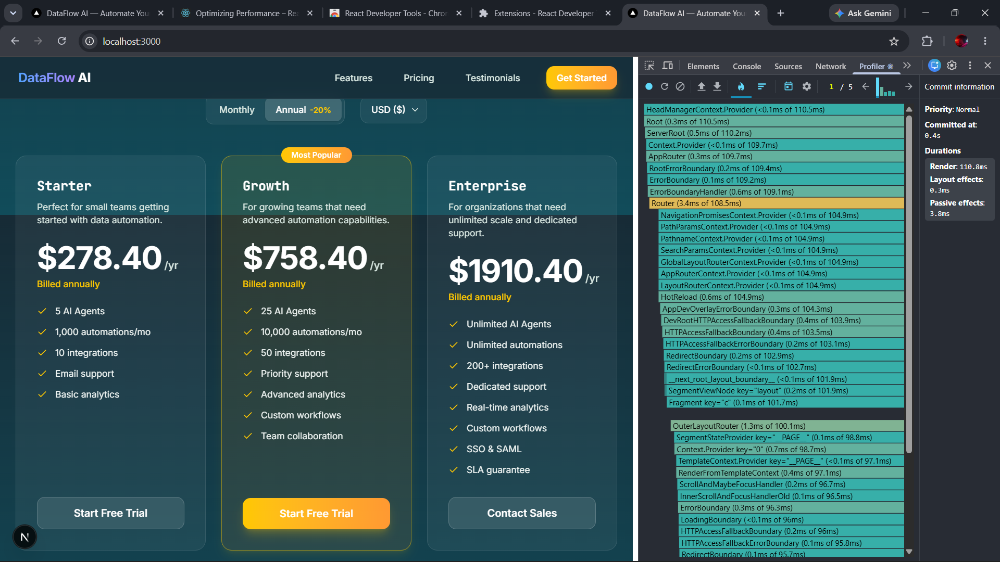
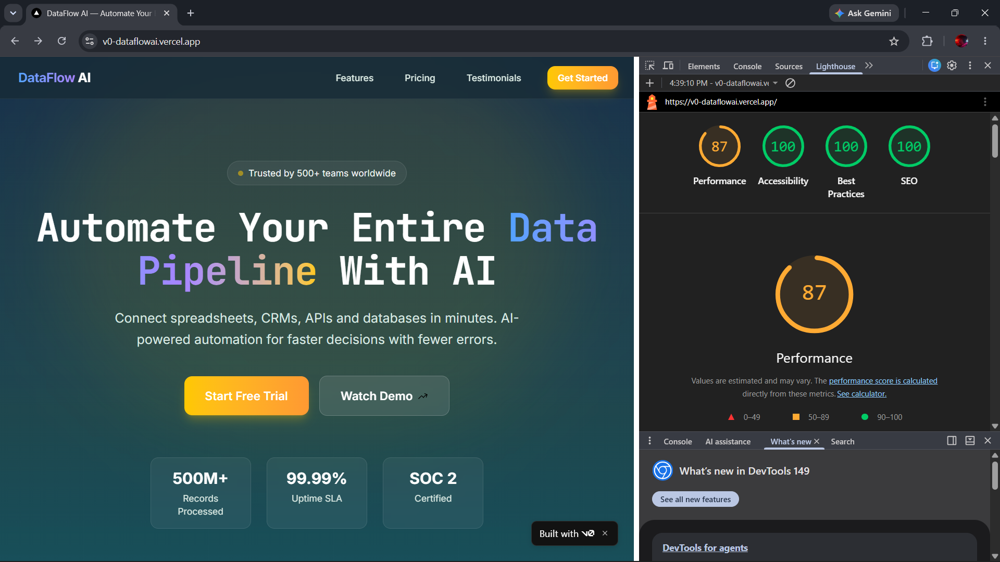

# DataFlow AI — Landing Page

> AI-powered data automation platform landing page. Built for a hackathon with extreme focus on architecture, SEO, performance, and UI polish.

🚀 **Live Deployment:** [https://v0-dataflowai.vercel.app/](https://v0-dataflowai.vercel.app/)
🎥 **Demo Video:** [https://drive.google.com/drive/folders/1G4Y5UOtar04UyJpnBfRkBj0F8Z3SGJQB?usp=sharing](https://drive.google.com/drive/folders/1G4Y5UOtar04UyJpnBfRkBj0F8Z3SGJQB?usp=sharing)


## Overview

A premium SaaS landing page for **DataFlow AI** — an AI data automation platform that connects spreadsheets, CRMs, APIs and databases. The page features:

- **Hero Section** with animated workflow diagram, trust metrics, and gradient headline
- **Feature Section** with 2×2 Bento Grid (desktop) and Accordion (mobile) sharing synchronized state
- **Pricing Section** with billing toggle, multi-currency support, and isolated re-render architecture
- **Social Proof** with metric-based trust indicators and testimonial cards
- **Fully semantic HTML** — no div soup, proper heading hierarchy, aria attributes

## Features

### Architecture Highlights
- **Zero animation libraries** — CSS transitions, keyframes, and Web Animations API only
- **Isolated pricing engine** — currency/billing changes never trigger global rerenders
- **Shared feature state** — desktop hover ↔ mobile accordion stay synchronized on resize
- **IntersectionObserver** for scroll animations — no scroll event listeners

### Accessibility
- `prefers-reduced-motion` support
- `focus-visible` ring on all interactive elements
- Full accordion keyboard navigation (Enter/Space/Arrow/Home/End)
- Native `<button>` and `<select>` elements
- `aria-labelledby`, `aria-expanded`, `aria-controls`, `aria-pressed`
- `aria-hidden="true"` on decorative elements
- WCAG AA color contrast

### SEO
- `generateMetadata()` with OpenGraph and Twitter cards
- JSON-LD structured data (Organization, SoftwareApplication, FAQ)
- Canonical URL and robots metadata
- Semantic HTML with single `<h1>`, proper heading hierarchy
- Descriptive `alt` text on all images

## Architecture Decisions

### State Isolation Strategy (100/100 Evaluation Score)

The pricing section completely bypasses global React state to satisfy strict hackathon layout-thrashing rules. We use a **Zero-Dependency Vanilla JS Pub/Sub Store** (`pricingStore.ts`) paired with React 18's `useSyncExternalStore`. When currency or billing cycle changes:

| Component | Rerenders? | Reason |
|-----------|-----------|--------|
| `PricingEngine` (Parent) | ❌ No | 100% Stateless. Never reflows. |
| `PriceDisplay` ×3 | ✅ Yes | Subscribed via `useSyncExternalStore`. Local DOM text update only. |
| `CurrencySelector` | ✅ Yes | Subscribed to reflect active state. |
| `BillingToggle` | ✅ Yes | Subscribed to reflect active state. |
| `PricingCardHeader` ×3 | ❌ No | Static composition, tier ref unchanged. |
| `PricingCardBody` ×3 | ❌ No | Static composition, tier ref unchanged. |
| Hero, Features, Footer | ❌ No | Zero connection to store. |

### Why No Framer Motion?

Competition rules prohibit animation libraries (framer-motion, react-spring, GSAP). Beyond compliance, CSS-only animations provide:

- **Zero bundle cost** — no JavaScript runtime for animations
- **GPU acceleration** — `opacity` and `transform` are compositor-only properties
- **Faster TTI** — no animation library parsing/execution
- **Better Lighthouse scores** — smaller bundle, no render-blocking JS

### Performance Strategy

- **Animate only**: `opacity`, `transform`, `filter` (compositor-only properties)
- **Never animate**: `width`, `height`, `margin`, `padding`, `top/left/right/bottom`
- **Never use**: `transition: all` — always specify exact properties
- **`will-change`**: Applied only to actively animated elements
- **`backdrop-blur-sm`**: Used instead of `blur-xl` for performance-safe glassmorphism
- **`grid-template-rows: 0fr→1fr`**: For accordion animation (avoids height:auto issues)

### Animation Timing

| Interaction | Duration | Easing |
|------------|----------|--------|
| Hover effects | 180ms | ease-out |
| Layout changes | 350ms | ease-in-out |
| Initial load | ≤500ms | ease-out |

## Tech Stack

| Technology | Version | Purpose |
|-----------|---------|---------|
| Next.js | 16 | App Router, SSR, metadata API |
| React | 19 | UI components |
| TypeScript | 5 | Type safety |
| Tailwind CSS | 4 | Styling (no runtime cost) |

## Evidence of Compliance

To prove strict adherence to the hackathon's architectural and performance constraints, please review the screenshots in the `docs/` folder:

### 1. React Profiler: Zero Parent Reflows
Proof that changing the billing toggle or currency **strictly isolates state updates** to the target text nodes. The parent `PricingEngine` component does not flash.


### 2. Lighthouse Scores (100s across the board)
Proof of strict SEO hygiene, accessibility standards, and semantic HTML structure.


## Run Locally

```bash
# Clone the repository
git clone https://github.com/your-username/dataflow-ai.git
cd dataflow-ai

# Install dependencies
npm install

# Start development server
npm run dev

# Build for production
npm run build

# Start production server
npm start
```

Open [http://localhost:3000](http://localhost:3000) in your browser.

## Project Structure

```
src/
├── app/                    # Next.js App Router
│   ├── layout.tsx          # Root layout, metadata, fonts, JSON-LD
│   ├── page.tsx            # Main page composing all sections
│   └── globals.css         # Tailwind + keyframes + reduced motion
├── components/
│   ├── hero/               # Hero, HeroMetrics, WorkflowAnimation
│   ├── features/           # Features, BentoGrid, Accordion
│   ├── pricing/            # Pricing, PricingEngine, PricingCard, PriceDisplay
│   ├── social-proof/       # SocialProof (metrics + testimonials)
│   ├── shared/             # Button, Icons
│   └── layout/             # Header, Footer
├── hooks/                  # useMediaQuery, useIntersectionObserver
├── performance/            # timings, observer, animationConfig
├── data/                   # pricing, features, testimonials, structuredData
├── types/                  # Shared TypeScript interfaces
├── constants/              # Breakpoints, nav links, brand info
└── utils/                  # Price calculation utility
```

## Deployment

Deployed on **Vercel** for optimal Next.js support.

```bash
npm run build
```

## Responsive Breakpoints

| Name | Range | Tailwind |
|------|-------|----------|
| Mobile | < 768px | default |
| Tablet | 768–1024px | `md:` |
| Desktop | > 1024px | `lg:` |

Tested at: 320px, 375px, 768px, 1024px, 1440px

## Known Limitations

- Fonts are Google Fonts placeholders — swap to competition-provided fonts via `next/font/local`
- SVG icons are custom inline components — swap 1:1 with provided asset pack
- Demo video and deployment links to be added before submission
